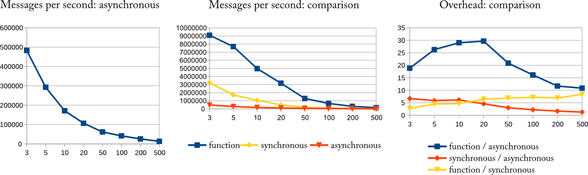

#React: functional reactive programming 
-----

Reakt is influenced by languages such as PureData and Max*.
It follows a simple methodology:
* processing is done in a graph
* nodes in the graph represent exactly one function that can output something depening on some input 
* connections between nodes can be either synchronous or asynchronous

##Features: 
* mixing asynchronous and synchronous processing seamlessly without any boilerplate stuff 
* uses memoization to reduce unnecessary re-computations/evaluations
* allows any data type to be handled reactively
* features higher order streams and transformations and allows mapping streams to other types or applying functions on streams very easily
* allows various ways to connect processing nodes, create various graph topologies
* the processing graph can be restructured online
* implicit type conversions to wrap expressions and constants (see example)
* additional helper methods to defer processing to other threads, e.g. you want to control something reactively that runs in a opengl render thread
* a dead simple DSL ... really!
* has been used for ~4 years now without any hicups, mostly stayed the same, not really much to add :-)

###About async/sync
* Synchronous processing uses direct method calls.
* Asynchronous processing uses Akka with a worker pool.

##Example
An example, that supposes there is some UI lib that has reactive properties for sliders and text labels (see my UltraCom project): 
```scala
val sliderValue <~ slider.value
sliderValue.observe { x =>
	println("My value is "+x)
}

val aValue = new VarA(3.0f)
textLabel.text <~ aValue.map(x => "My value is "+x)
val mulitpliedValue <~ slider.value * aValue
val someBooleanStream <~ (multipliedValue < 200.0f) && button.pressed

aValue() = 4
```
The '<~' operator connects or creates signals (streams). The first line creates a new node in the graph (sliderValue) which will receive new values if the slider is changed.
You can observe our new node by simply passing a observer function. This one does nothing fancy, it just sits there and receives values - and prints them.
The next line (val aValue = new VarA(3.0f)) creates a new node explicitly with an initial value (3.0f) which will post messages asynchronously. VarA is for asynchronous
processing, VarS for synchronous processing (function calls). You can connect these either way using the '<~' operator, it will take care of everything.
We now map the value stream of 'aValue' to a string Stream in the next line using 'aValue.map(x => "My value is "+x)' and then connect it to some reactive
property of a (hypothetical) text label. 

The next lines are more interesting because we are using some of the operators provided by react here. 
The multipliedValue gets a new stream which contains the result of slider.value times aValue. If either of these changes multipliedValue is updated.
someBooleanStream takes this further and shows that you can also compare streams and combine them for logical operations to create a boolean stream.
In the last line it is shown how you can simply update a stream (or node) by "assigning" it a new value. Afterwards, everything that depends on
aValue will get updated accordingly. Pretty simple, huh?

Of course, in the background there are some additional nodes created and some implicit type conversions performed.
From the example above, the graph that is created looks like this, internally: 


There are additional operators and functions for mapping, connecting/disconnecting, math ops, merges, using tuples etc.
For now, you can look at https://github.com/lodsb/reakt/blob/master/src/main/scala/org/lodsb/reakt/Reactive.scala#L209 , https://github.com/lodsb/reakt/blob/master/src/main/scala/org/lodsb/reakt/graph/Graph.scala#L210 , 
https://github.com/lodsb/reakt/blob/master/src/main/scala/org/lodsb/reakt/Reactive.scala#L167 - sorry for the inconvenience!

##Performance
Of course, there is an overhead added when using Reakt.
As a simple test, I created a straight pipeline of processing steps using a) direct function calls b) synchronous reakt c) asynchronous reakt.
These are the results for various pipeline lengths (3 to 500 nodes). Note that such long pipelines are - in my opinion - not that common in practical implementations.



For this silly example (we would have to test more graph topologies), it is apparent that the asynchronous message passing has at least a ten-fold execution overhead compared to direct function calls and, similarly an overhead of the factor 2 - 8.
This can be traced back to the mechanisms in the actor implementation (eg. thread scheduling, resulting delays in message receipt).
Conversely, the overhead of the synchronous graph execution compared to direct calls (roughly a factor 5 in the experiments) can be accounted to the delegation method.


*Note: this is more of a rant but I am slightly bored of the fact that nearly all publications or buzzword bingo slides about reactive programming
simply neglect the fact that reactive/dataflow programming has been around since the late 60s. It has been applied in languages
such as Max for already 25 years. 

TODO (features and notes to myself, unordered):
- higher kind function application streams (f, data) => apply
- allowing recursion (currently cyclic message passing is detected and the message is dropped) - I implemented this as a measure to reduce errors, but I think reactive recursion (?) can be valuable to 
implement multi-level processing 
- packing/unpacking and applying tuples as function argument streams
- recheck covariance
- higher order actvie routing (switch/scanner etc)
- named variables
- pull processing (i have to think that - there are various ways to implement it properly) 
